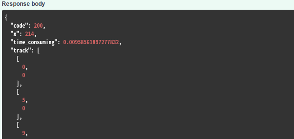

# slider-captcha-hack 滑动验证码识别

双图滑动验证码识别工具，支持 docker 部署，HTTP API 访问，支持鼠标路径生成。

注意，仅支持双图验证类型，你需要找到验证码的滑块和背景图，并转为 base64 发送请求。


## 接口简介

POST `/slider_captcha` 滑动验证码验证接口 参数为 json

参数：

| 参数名称                   | 参数说明                       | 是否必须 | 数据类型 |
| -------------------------- | ------------------------------ | -------- | -------- |
| &emsp;&emsp;img_slider     | 滑块图片                       | true     | string   |
| &emsp;&emsp;img_background | 背景图片                       | true     | string   |
| &emsp;&emsp;auto_cut       | 是否自动裁剪滑块图片 默认 true | false    | boolean  |
| &emsp;&emsp;with_track     | 是否返回轨迹 默认 false        | false    | boolean  |
| &emsp;&emsp;key            | 验证密码                       | false    | string   |

返回示例



x 为最终 x 坐标，如果`with_track`为 true 那么将返回坐标对应的模拟鼠标轨迹，格式为 x,y

你也可以单独生成轨迹通过接口`/track` 具体使用方法可参阅文档

## 本地运行

需求：[poetry](https://python-poetry.org/)

在项目根目录下，执行

```bash
# 安装依赖
poetry install
# 运行
poetry run uvicorn slider_captcha.api:app
```

启动后可在 [http://127.0.0.1:8000/doc](http://127.0.0.1:8000/doc) 下查看文档

## 注意事项

如果你将要在公网或服务器等部署，建议加入一个验证密码，避免被滥用：

即设置环境变量 `SLIDER_CAPTCHA_KEY=你的密码`

此外，参数中图片的 base64 不应该包含`data:image/png;base64,`等前缀

## Docker 运行

TODO

## Docker 编译

在项目根目录下，执行

```bash
# 构建镜像
sudo docker build -t slider-captcha .
# 运行
sudo docker run -p 8000:8000 slider-captcha:latest
```

## 感谢

鼠标轨迹模拟使用的是 [2833844911/gurs](https://github.com/2833844911/gurs)

如果对你有帮助，欢迎 star✨
